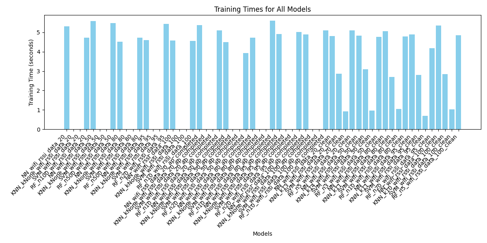

# WiFi Signal Locator Project

## Introduction

The WiFi Signal Locator Project is an indoor localization system that uses WiFi signals to determine the user's location. The system leverages RSSI (Received Signal Strength Indicator) values from nearby WiFi access points and applies machine learning models to predict the user's position. This project is divided into three main components:

1. **app_wifi_scanner**: For scanning and collecting WiFi data points.
2. **main.py**: For processing the acquired data and training machine learning models.
3. **app_live_data_prediction**: For performing real-time inference using trained models.

---

## What Are We Trying to Do?

The goal of this project is to create a robust indoor localization system that can:
- Collect WiFi signal data from various access points.
- Process and clean the data for machine learning.
- Train multiple machine learning models to predict the user's location.
- Test the impact of different train/test split ratios on model performance.
- Provide a real-time web-based interface for location prediction.

This system is particularly useful in environments like malls, airports, or university campuses where GPS signals are weak or unavailable.

---

## Models Used

The project uses the following machine learning models for location prediction:

### 1. Neural Network (NN)
- **Purpose**: A deep learning model that can handle complex patterns in the data.
- **Architecture**: 
  - Input layer: Takes the RSSI values and missing value indicators.
  - Hidden layers: Multiple layers with ReLU activation and dropout for regularization.
  - Output layer: Predicts the user's location.
- **Advantages**:
  - Can handle non-linear relationships in the data.
  - Robust to missing values using missing value indicators.

### 2. K-Nearest Neighbors (KNN)
- **Purpose**: A simple, instance-based learning algorithm.
- **How It Works**:
  - Finds the `k` nearest neighbors to a data point based on RSSI values.
  - Predicts the location based on the majority class of the neighbors.
- **Advantages**:
  - Easy to implement and interpret.
  - Works well with small datasets.

### 3. Support Vector Machine (SVM)
- **Purpose**: A supervised learning model for classification.
- **How It Works**:
  - Finds a hyperplane that best separates the data into classes.
  - Uses a linear kernel for simplicity.
- **Advantages**:
  - Effective in high-dimensional spaces.
  - Works well with a clear margin of separation.

### 4. Random Forest (RF)
- **Purpose**: An ensemble learning method using decision trees.
- **How It Works**:
  - Builds multiple decision trees during training.
  - Outputs the class that is the mode of the classes predicted by individual trees.
- **Advantages**:
  - Handles missing data well.
  - Reduces overfitting compared to individual decision trees.

---

## Components

### 1. app_wifi_scanner

#### Purpose
The `app_wifi_scanner` module scans and collects WiFi data points. It gathers RSSI values from nearby access points and stores them for further processing.

#### How It Works
- Uses the `pywifi` library to interface with the WiFi hardware.
- Scans for available WiFi networks and records their MAC addresses and RSSI values.
- Saves the collected data in the `data` directory.

#### How to Run
1. Navigate to the `app_wifi_scanner` directory:
   ```bash
   cd app_wifi_scanner
   ```
2. Run the scanner:
   ```bash
   python scanner.py
   ```
3. The scanned data will be saved in the `data` directory.

---

### 2. main.py

#### Purpose
The `main.py` script processes the collected WiFi data, generates multiple datasets, and trains machine learning models.

#### How It Works
1. **Pre-processing**:
   - Combines multiple raw data files into a single dataset.
   - Maps MAC addresses to SSIDs for better interpretability.
   - Saves the processed data in `./raw_data/wifi_rssi_data.csv`.

2. **Post-processing**:
   - Generates multiple datasets with different handling of missing values:
     - **Original Dataset**: Contains missing values as-is.
     - **Complete Dataset**: Fills missing values using the average RSSI value for each access point per zone.
     - **Imputed Dataset**: Replaces all missing values with a constant (-95 dBm).
   - Ensures the datasets are ready for model training.

3. **Model Training**:
   - Trains the following models:
     - Neural Network
     - K-Nearest Neighbors
     - Support Vector Machine
     - Random Forest
   - Tests the impact of different train/test split ratios (e.g., 20/80, 80/20).
   - Saves the trained models in the `./models` directory.

#### How to Run
1. Ensure the `app_wifi_scanner/data` directory contains the collected WiFi data.
2. Run the script:
   ```bash
   python main.py
   ```

---

### 3. app_live_data_prediction

#### Purpose
The `app_live_data_prediction` module is a Flask-based web application for real-time location prediction.

#### How It Works
1. **User Interface**:
   - Users can select a model (NN, KNN, SVM, RF).
   - Users can choose a test/train split and access point percentage.

2. **Inference**:
   - Scans for live WiFi data.
   - Uses the selected model to predict the user's location.

3. **Output**:
   - Displays the top three predicted locations with confidence scores.

#### How to Run
1. Navigate to the `app_live_data_prediction` directory:
   ```bash
   cd app_live_data_prediction
   ```
2. Install the required dependencies:
   ```bash
   pip install -r requirements.txt
   ```
3. Run the Flask application:
   ```bash
   python src/app.py
   ```
4. Open your browser and navigate to `http://127.0.0.1:5000`.

---

## Challenges and Solutions

### 1. Handling Missing Values
- **Challenge**: RSSI values are often missing due to weak signals or interference.
- **Solution**: 
  - Replace missing values with a constant (-95 dBm).
  - Use missing value indicators in the Neural Network model.

### 2. Large Datasets
- **Challenge**: Processing large datasets caused memory issues.
- **Solution**: 
  - Used efficient libraries like `pandas` and `numpy`.
  - Split the data into smaller chunks for processing.

### 3. Real-Time Inference
- **Challenge**: Ensuring low latency during real-time predictions.
- **Solution**: 
  - Optimized the preprocessing pipeline.
  - Used lightweight models like KNN and SVM for faster predictions.

---

## Train/Test Split Testing

### Purpose
To evaluate the impact of different train/test split ratios on model performance, we tested splits such as:
- **20/80 Split**: 20% of the data for training, 80% for testing.
- **80/20 Split**: 80% of the data for training, 20% for testing.

### Observations
- **20/80 Split**:
  - Models trained on smaller datasets (20% training data) showed lower accuracy and higher variance in predictions.
  - Training times were significantly shorter due to the smaller dataset size.
- **80/20 Split**:
  - Models trained on larger datasets (80% training data) achieved higher accuracy and more stable predictions.
  - Training times were longer due to the increased dataset size.

### Results

The training times for each model in the two splits are visualized below:

#### Training Times for 20/80 Split

*Figure 1: Training times for models with 20% training data and 80% testing data.*

#### Training Times for 80/20 Split

*Figure 2: Training times for models with 80% training data and 20% testing data.*

---

## Requirements

Install the required dependencies using the provided `requirements.txt` file:
```bash
pip install -r requirements.txt
```

### Key Libraries
- Flask
- PyTorch
- NumPy
- Pandas
- Scikit-learn
- Matplotlib
- tqdm
- pywifi

---

## Directory Structure

```
Full stack/
├── app_wifi_scanner/
│   ├── data/
│   ├── scanner.py
│   └── ...
├── raw_data/
│   ├── wifi_rssi_data.csv
│   ├── mac_ssid_mapping.csv
│   └── ...
├── models/
│   ├── NN/
│   ├── KNN/
│   ├── SVM/
│   ├── RandomForest/
│   └── ...
├── app_live_data_prediction/
│   ├── src/
│   │   ├── app.py
│   │   ├── inference.py
│   │   ├── templates/
│   │   │   └── wifi-locator-webapp.html
│   │   └── ...
│   └── ...
├── main.py
├── README.md
└── requirements.txt
```

---

## Conclusion

The WiFi Signal Locator Project demonstrates the feasibility of using WiFi signals for indoor localization. Key takeaways include:
- **Handling Missing Values**: Imputing missing values with a constant (-95 dBm) or using averages per zone significantly improves model performance.
- **Train/Test Split Impact**: Larger training datasets (e.g., 80/20 split) result in better model accuracy but require longer training times.
- **Model Selection**: Neural Networks and Random Forests performed well across different datasets, while KNN and SVM were faster but less accurate in some cases.

Future work could focus on:
- Optimizing model architectures for faster inference.
- Exploring additional features such as signal variance or time-based patterns.
- Extending the system to support multi-floor localization.
